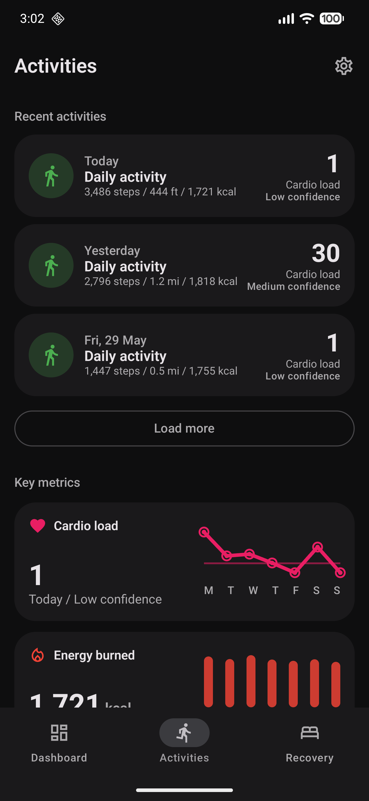
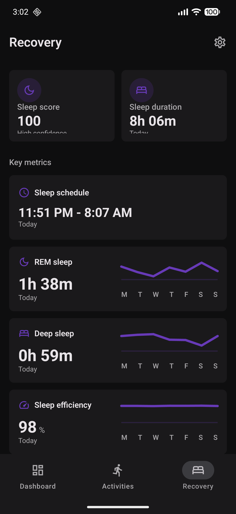

# Screenshots

<figure markdown="1">
{ .app-screenshot }
<figcaption>Dashboard</figcaption>
</figure>

<figure markdown="1">
{ .app-screenshot }
<figcaption>Steps weekly view</figcaption>
</figure>

<figure markdown="1">
{ .app-screenshot }
<figcaption>Activity entry</figcaption>
</figure>

<figure markdown="1">
{ .app-screenshot }
<figcaption>Metric entry grid</figcaption>
</figure>

<figure markdown="1">
{ .app-screenshot }
<figcaption>Activities</figcaption>
</figure>

<figure markdown="1">
{ .app-screenshot }
<figcaption>Recovery</figcaption>
</figure>

<figure markdown="1">
{ .app-screenshot }
<figcaption>Hydration entry</figcaption>
</figure>

<figure markdown="1">
{ .app-screenshot }
<figcaption>Mindfulness entry</figcaption>
</figure>

