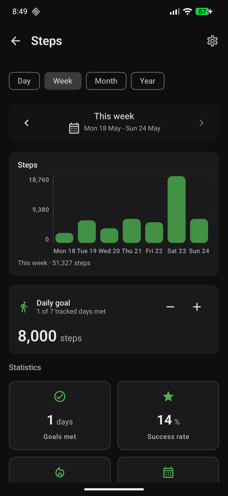
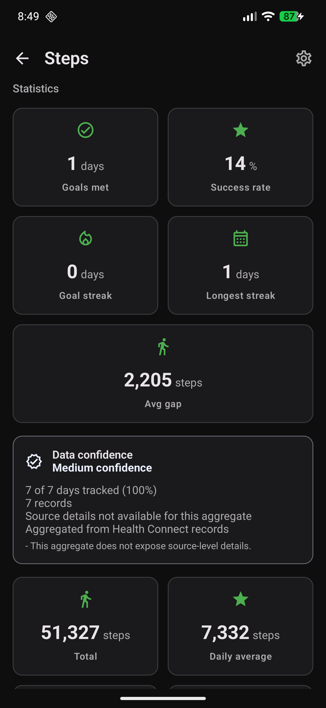
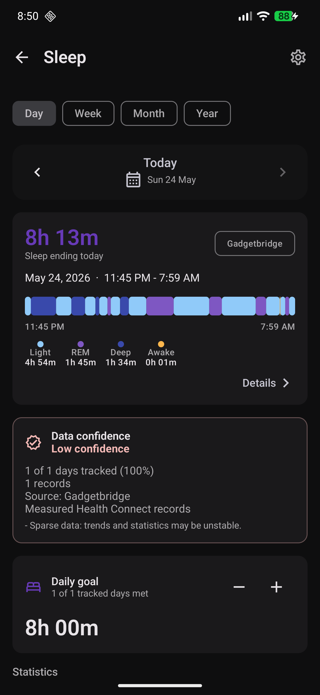
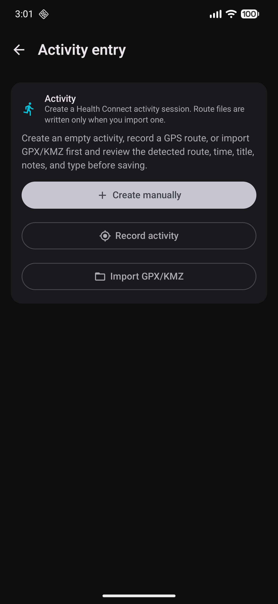
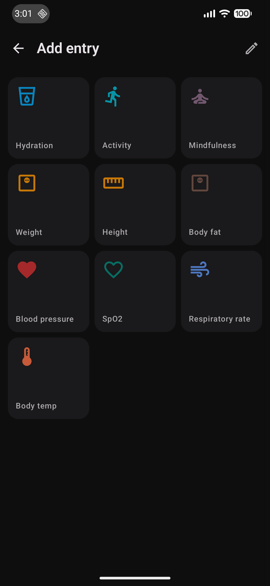
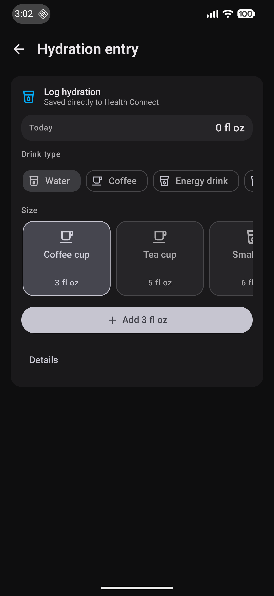
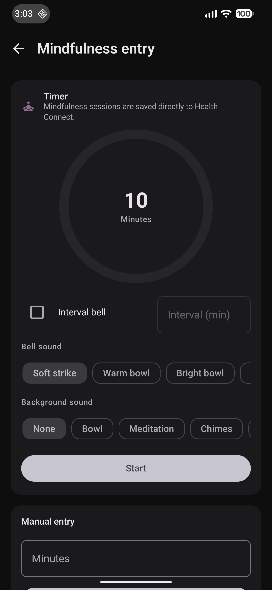

# Screenshots

These screenshots show the current summary-first app navigation and focused metric screens.

## Current Assets

| Image | Purpose |
| --- | --- |
| `docs/assets/images/dashboard.png` | Dashboard and summary-first navigation. |
| `docs/assets/images/steps-week.png` | Steps weekly detail view. |
| `docs/assets/images/steps-statistics.png` | Steps statistics and period context. |
| `docs/assets/images/sleep.png` | Sleep detail view. |
| `docs/assets/images/activity-entry.png` | Activity entry flow. |
| `docs/assets/images/metric-entry-grid.png` | Manual metric entry grid. |
| `docs/assets/images/hydration-entry.png` | Hydration and beverage entry. |
| `docs/assets/images/mindfulness-entry.png` | Mindfulness entry. |

## Preview

<figure markdown="1">
{ .app-screenshot }
<figcaption>Dashboard</figcaption>
</figure>

<figure markdown="1">
{ .app-screenshot }
<figcaption>Steps weekly view</figcaption>
</figure>

<figure markdown="1">
{ .app-screenshot }
<figcaption>Steps statistics</figcaption>
</figure>

<figure markdown="1">
{ .app-screenshot }
<figcaption>Sleep detail</figcaption>
</figure>

<figure markdown="1">
{ .app-screenshot }
<figcaption>Activity entry</figcaption>
</figure>

<figure markdown="1">
{ .app-screenshot }
<figcaption>Metric entry grid</figcaption>
</figure>

<figure markdown="1">
{ .app-screenshot }
<figcaption>Hydration entry</figcaption>
</figure>

<figure markdown="1">
{ .app-screenshot }
<figcaption>Mindfulness entry</figcaption>
</figure>

## Maintenance Notes

- Update screenshots when navigation, permissions, major metric screens, or entry flows change visually.
- Keep screenshot filenames stable when they are referenced from README or release material.
- Add new screenshots to `docs/images/` before linking them from Markdown.
