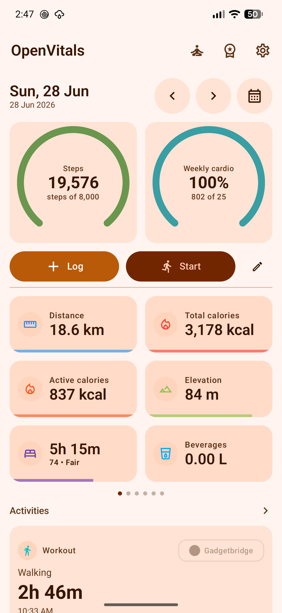
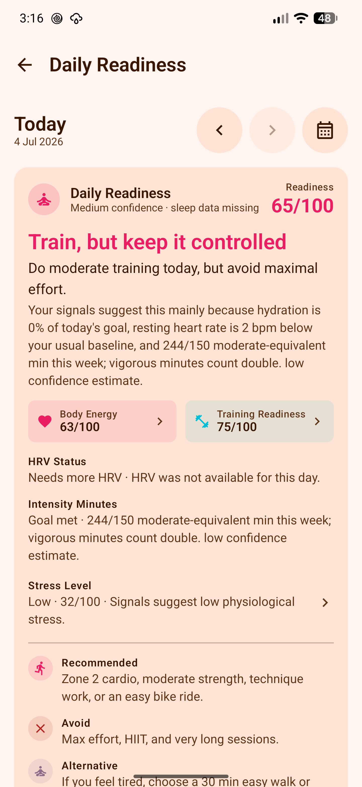

# OpenVitals

OpenVitals is a local-first Android app for viewing, logging, importing, and understanding health data from Health Connect.

It is for people who want a clear daily dashboard, focused metric detail screens, and explicit write/import flows without creating an account, uploading health data, or depending on an online service.

[Install](app/install.md){ .md-button .md-button--primary }
[Getting Started](app/getting-started.md){ .md-button }
[Features](features/index.md){ .md-button }
[Support](support.md){ .md-button }

{ .home-screenshot }
{ .home-screenshot .home-screenshot-secondary }

## Find What You Need

### Start

- [Install](app/install.md)
- [Getting started](app/getting-started.md)
- [Health Connect setup](app/health-connect.md)
- [FAQ](app/faq.md)

### Browse

- [Feature overview](features/index.md)
- [Dashboard and widgets](features/health-connect-metrics-dashboard.md)
- [Metric detail customization](features/metric-detail-customization.md)
- [Screenshots](screenshots.md)

### Understand Access

- [Privacy](app/privacy.md)
- [Permissions](app/permissions.md)
- [Privacy, support, and diagnostics](features/privacy-support-diagnostics.md)

### Do More

- [Manual entry](features/manual-entry-metrics.md)
- [Beverage logging and caffeine](features/beverage-logging-and-caffeine.md)
- [Activity recording](features/activity-recording.md)
- [Apple Health import](features/apple-health-import.md)

## Main Feature Areas

### Dashboard & App

[Summary widgets](features/health-connect-metrics-dashboard.md), [local derived metrics](features/non-health-connect-metrics-dashboard.md), [home screen widgets](features/home-widgets.md), [onboarding](features/onboarding-and-permissions.md), [settings](features/settings-and-preferences.md), and [achievements](features/achievements.md).

### Health Metrics

[Activity](features/activity-metrics.md), [sleep](features/sleep-tracking.md), [readiness](features/daily-readiness.md), [Body Energy](features/body-energy.md), [heart and vitals](features/heart-and-vitals.md), [body](features/body-metrics.md), [nutrition](features/nutrition.md), [hydration](features/hydration.md), [mindfulness](features/mindfulness.md), and [cycle tracking](features/cycle-tracking.md).

### Log, Import & Record

[Manual entries](features/manual-entry-metrics.md), [drink logging](features/beverage-logging-and-caffeine.md), [GPS and repetition activity recording](features/activity-recording.md), [Bluetooth LE sensors](features/ble-sensors.md), [route/FIT imports](features/route-file-import.md), [offline maps](features/offline-maps-support.md), and [Apple Health imports](features/apple-health-import.md).

## Local First

The local OpenVitals app does not ship app-level internet permission. It reads supported records from Health Connect, writes only when you explicitly save, import, record, edit, or delete data, and keeps app preferences on the device.

## Support And Code

[Support OpenVitals](support.md){ .md-button .md-button--primary }
[Changelog](releases/changelog.md){ .md-button }
[Build From Source](developers/build.md){ .md-button }

- Android app: [codeberg.org/OpenVitals/android-app](https://codeberg.org/OpenVitals/android-app)
- Documentation: [codeberg.org/OpenVitals/docs](https://codeberg.org/OpenVitals/docs)
