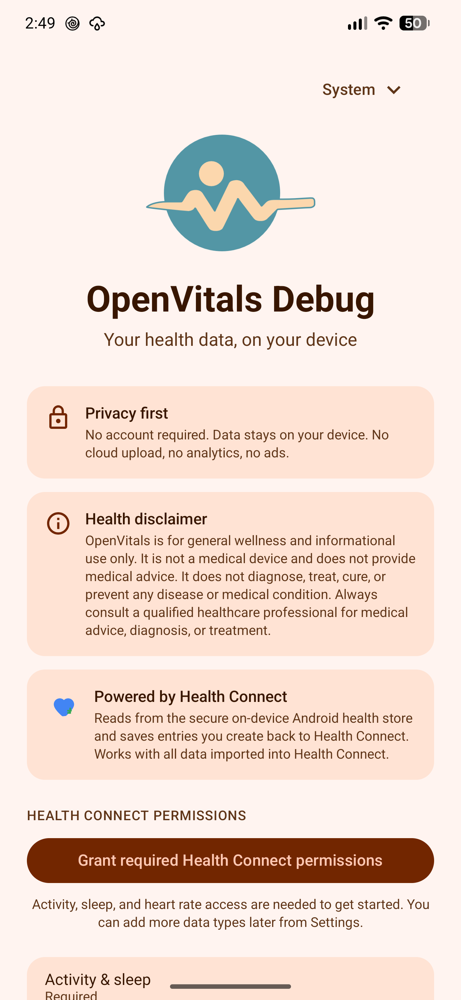
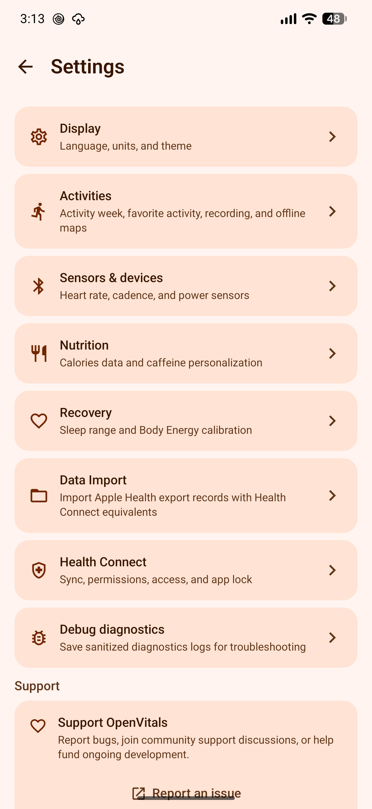
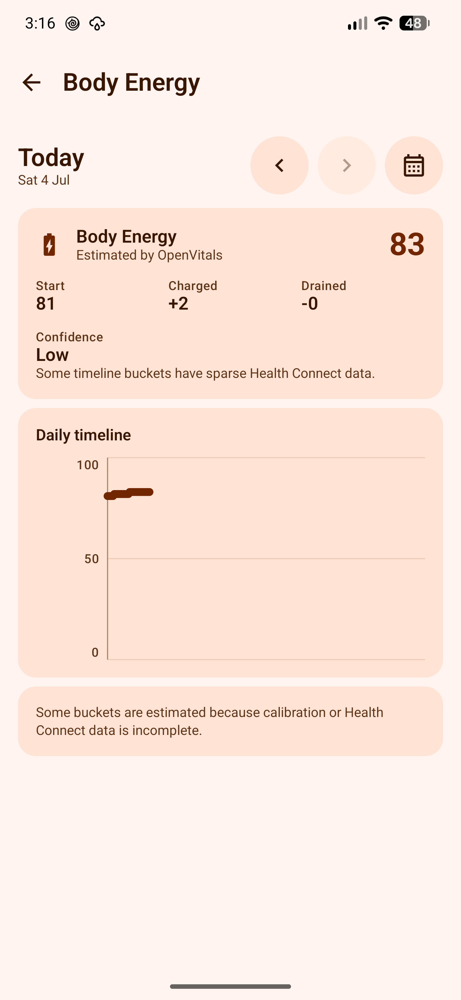
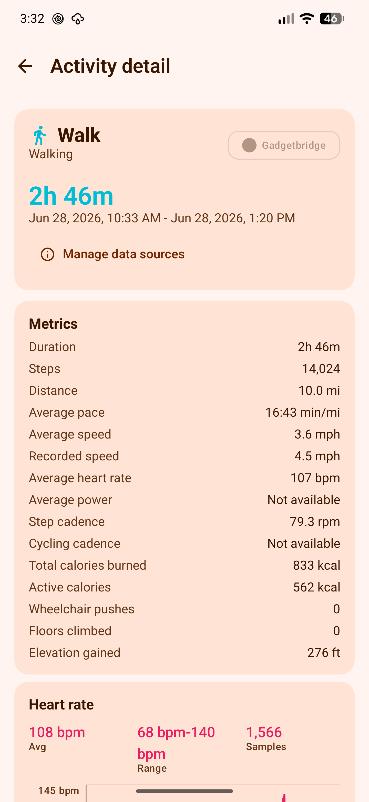
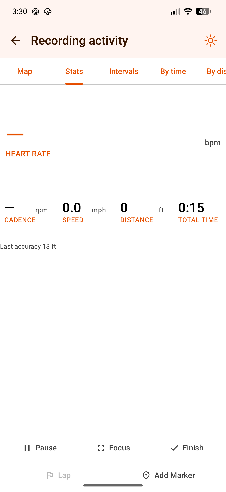
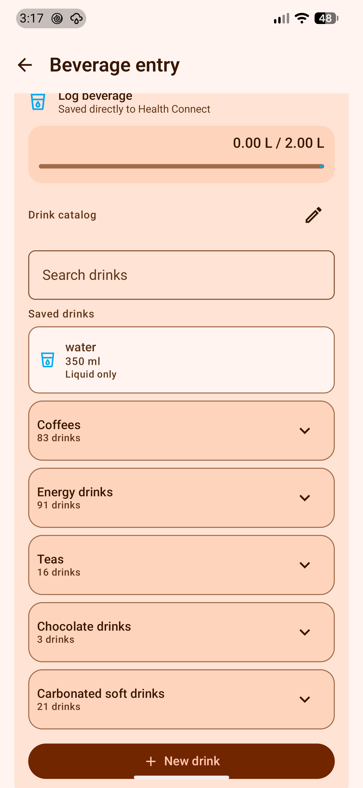

# Screenshots

These screenshots show the current summary-first app navigation, setup, settings, focused metric screens, and entry flows.

## Current Assets

| Image | Purpose |
| --- | --- |
| `docs/assets/images/dashboard.png` | Dashboard and summary-first navigation. |
| `docs/assets/images/onboarding.png` | Health Connect onboarding and permission setup. |
| `docs/assets/images/settings.png` | Settings and app configuration. |
| `docs/assets/images/daily-readiness.png` | Daily Readiness detail view. |
| `docs/assets/images/body-energy.png` | Body Energy detail view. |
| `docs/assets/images/activity-detail.png` | Activity detail view. |
| `docs/assets/images/activity-recording.png` | Activity recording controls. |
| `docs/assets/images/beverage-entry.png` | Beverage and caffeine entry. |
| `docs/assets/images/garmin-watch-device.png` | A paired Garmin watch and its actions. |
| `docs/assets/images/garmin-watch-data.png` | Watch measures Health Connect has no type for. |

## Preview

<figure markdown="1">
{ .app-screenshot }
<figcaption>Dashboard</figcaption>
</figure>

<figure markdown="1">
{ .app-screenshot }
<figcaption>Onboarding</figcaption>
</figure>

<figure markdown="1">
{ .app-screenshot }
<figcaption>Settings</figcaption>
</figure>

<figure markdown="1">
{ .app-screenshot }
<figcaption>Daily Readiness</figcaption>
</figure>

<figure markdown="1">
{ .app-screenshot }
<figcaption>Body Energy</figcaption>
</figure>

<figure markdown="1">
{ .app-screenshot }
<figcaption>Activity detail</figcaption>
</figure>

<figure markdown="1">
{ .app-screenshot }
<figcaption>Activity recording</figcaption>
</figure>

<figure markdown="1">
{ .app-screenshot }
<figcaption>Beverage entry</figcaption>
</figure>

## Maintenance Notes

- Update screenshots when navigation, permissions, major metric screens, or entry flows change visually.
- Keep screenshot filenames stable when they are referenced from README or release material.
- Add new screenshots to `docs/assets/images/` before linking them from Markdown.
